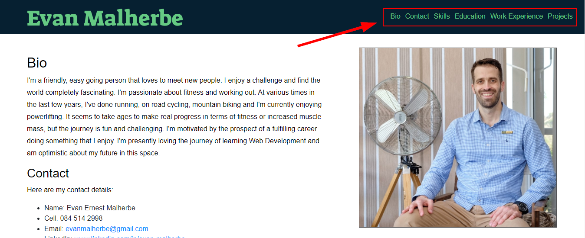

# HyperionDev Full Stack Web Development Bootcamp - Level 2 Task 6 - Resume website

## Description
This is a resume or CV website for myself (Evan Malherbe) that provides a demonstration of my web design skills, as well as providing
information about me, my work history and skills.

## Table of Contents
* [Instructions](#instructions)
* [Technologies](#technologies)
* [Installation](#installation)
* [Usage](#usage)
* [Credits](#credits) 

## Instructions
These were the instructions I was given to guide me in creating this website. 

In this task, you are going to be creating a personal webpage. Make sure that this webpage acts as a resume and introduces you to the world effectively. Strike a balance in your content - this webpage should show more of your personality than a typical CV but it should still be
 professional.

**Follow these steps:**
* Create an HTML page called index.html.
* On this page add any elements you would like to create a webpage that acts as an online CV. This is your personal webpage, so feel free to customise it to suit your needs but make sure that you include at least the following:
    * A short bio. Add a short (no more than about three paragraphs) description of yourself. Who are you? What is your experience? What 
    are your passions? What motivates you? What is it that you would most like to do? Etc.
    * Your contact details. E.g. name, contact number, email address, links to any of your (professional) social media including LinkedIn. An
    image of yourself.
    * A list of your skills and competencies.
    * Describe your education.
    * Describe your work experience.
    * Describe some projects that you have worked on. Add links to the code (in GitHub).
    * Add links to any blog posts or articles that you have written.
* Use CSS to style and position the elements on your webpage that you created in the previous task (“index.html”) as attractively as possible. Feel free to use style libraries like Bootstrap. You can also use Bootstrap Studio, which is one of the tools in the GitHub Student Developer Pack, if you like. This will involve doing a bit of research.

### Technologies
This project uses:
* HTML 5 
* CSS 3

## Installation
If you'd like to look through my code for this project, you can view my GitHub repository for the project - [Evan Malherbe Resume](https://github.com/evanmalherbe/Evan_Malherbe_resume). To clone this respository to your local machine, use the following URL's: 
[SSH](git@github.com:evanmalherbe/Evan_Malherbe_resume.git) or [HTTPS](https://github.com/evanmalherbe/Evan_Malherbe_resume.git) . To learn how to clone a Git repository, go to [Cloning a Repository](https://docs.github.com/en/repositories/creating-and-managing-repositories/cloning-a-repository) .

## Usage
To use this website, simply click on the navigation links at the top right side of the page and you will be able to jump to a section of
the website that interests you. See figure 1 below.

 

### Credits
This website was created by Evan Malherbe during the HyperionDev Full Stack Web Development Bootcamp November 2021 [GitHub profile](https://github.com/evanmalherbe) 